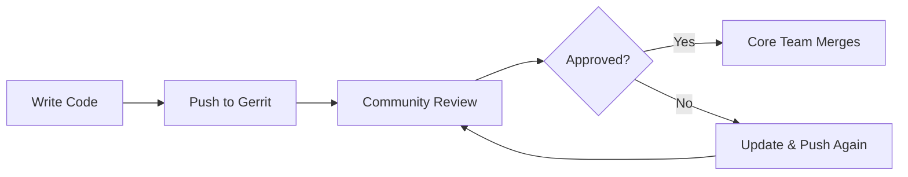

# Contribute to TYPO3

Welcome to the TYPO3 Core contribution starter kit. This guide will help you set up your development environment and submit your first patch.

## Why Contribute?

TYPO3 is an open source project that relies on community contributions. Whether you're fixing a bug, adding a feature, or improving documentation, your contribution matters.

## How TYPO3 Contribution Works

Unlike GitHub/GitLab workflows, TYPO3 uses **Gerrit** for code review:



- **Forge** - Issue tracker (like GitHub Issues)
- **Gerrit** - Code review system (like GitHub PRs)
- **Single Sign-On** - One account for everything

## Quick Start

1. [Check Prerequisites](prerequisites.md) - Tools you need
2. [Create Accounts](accounts.md) - TYPO3.org, Gerrit, Forge
3. [Clone & Configure](clone-and-configure.md) - Get the code
4. [Set Up DDEV](ddev-setup.md) - Local environment
5. [Install TYPO3](typo3-install.md) - Database & backend
6. [Make Your First Contribution](contribution-workflow.md)

## One-Line Setup

Already have the prerequisites? Run this in your TYPO3 clone:

```bash
curl -sL https://dkd-dobberkau.github.io/contribute-to-typo3/install.sh | bash
```

## Credits

This guide is based on the [Official TYPO3 Contribution Guide](https://docs.typo3.org/core-contribution) maintained by the [TYPO3 Documentation Team](https://typo3.org/community/teams/documentation). Thank you to all contributors who make TYPO3 documentation excellent.

## Resources

- [Official TYPO3 Contribution Guide](https://docs.typo3.org/core-contribution)
- [TYPO3 Slack #typo3-cms-coredev](https://typo3.slack.com)
- [Forge Issue Tracker](https://forge.typo3.org/projects/typo3cms-core/issues)
- [Gerrit Code Review](https://review.typo3.org)

---

*TYPO3 is a registered trademark of the [TYPO3 Association](https://typo3.org/project/association). See [The Brand](https://typo3.com/typo3-cms/the-brand) for trademark guidelines.*
