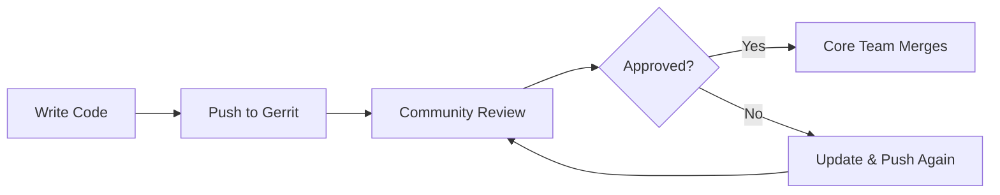

# contribute-to-typo3 Implementation Plan

> **For Claude:** REQUIRED SUB-SKILL: Use superpowers:executing-plans to implement this plan task-by-task.

**Goal:** Build a MkDocs Material documentation site with helper scripts that guides developers through TYPO3 Core contribution setup.

**Architecture:** Static documentation site generated by MkDocs Material, deployed to GitHub Pages via GitHub Actions. Config bundle with interactive install script for automated git/DDEV configuration.

**Tech Stack:** MkDocs Material, GitHub Actions, Bash scripting

---

## Task 1: Create MkDocs Configuration

**Files:**
- Create: `mkdocs.yml`
- Create: `requirements.txt`

**Step 1: Create requirements.txt**

```txt
mkdocs-material>=9.5
```

**Step 2: Create mkdocs.yml**

```yaml
site_name: Contribute to TYPO3
site_url: https://dkd-dobberkau.github.io/contribute-to-typo3/
site_description: A getting-started guide for contributing to TYPO3 Core
site_author: dkd-dobberkau

repo_name: dkd-dobberkau/contribute-to-typo3
repo_url: https://github.com/dkd-dobberkau/contribute-to-typo3

theme:
  name: material
  palette:
    - scheme: default
      primary: deep orange
      accent: orange
      toggle:
        icon: material/brightness-7
        name: Switch to dark mode
    - scheme: slate
      primary: deep orange
      accent: orange
      toggle:
        icon: material/brightness-4
        name: Switch to light mode
  features:
    - navigation.instant
    - navigation.tracking
    - navigation.sections
    - navigation.expand
    - content.code.copy
    - content.code.annotate
    - search.highlight
    - search.suggest
  icon:
    repo: fontawesome/brands/github

markdown_extensions:
  - admonition
  - pymdownx.details
  - pymdownx.superfences
  - pymdownx.highlight:
      anchor_linenums: true
  - pymdownx.inlinehilite
  - pymdownx.snippets
  - pymdownx.tabbed:
      alternate_style: true
  - attr_list
  - md_in_html
  - tables

nav:
  - Home: index.md
  - Getting Started:
    - Prerequisites: prerequisites.md
    - Create Accounts: accounts.md
  - Setup:
    - Clone & Configure Git: clone-and-configure.md
    - DDEV Environment: ddev-setup.md
    - Install TYPO3: typo3-install.md
  - Contributing:
    - Contribution Workflow: contribution-workflow.md
    - Review Process: review-process.md
  - Help:
    - Troubleshooting: troubleshooting.md
    - Command Reference: reference.md

extra:
  social:
    - icon: fontawesome/brands/github
      link: https://github.com/dkd-dobberkau/contribute-to-typo3
    - icon: fontawesome/brands/slack
      link: https://typo3.slack.com
```

**Step 3: Commit**

```bash
git add mkdocs.yml requirements.txt
git commit -m "feat: add MkDocs Material configuration"
```

---

## Task 2: Create GitHub Actions Workflow

**Files:**
- Create: `.github/workflows/deploy.yml`

**Step 1: Create deploy workflow**

```yaml
name: Deploy MkDocs to GitHub Pages

on:
  push:
    branches:
      - main
  workflow_dispatch:

permissions:
  contents: read
  pages: write
  id-token: write

concurrency:
  group: "pages"
  cancel-in-progress: false

jobs:
  build:
    runs-on: ubuntu-latest
    steps:
      - name: Checkout
        uses: actions/checkout@v4

      - name: Setup Python
        uses: actions/setup-python@v5
        with:
          python-version: '3.12'

      - name: Install dependencies
        run: pip install -r requirements.txt

      - name: Build MkDocs site
        run: mkdocs build --strict

      - name: Upload artifact
        uses: actions/upload-pages-artifact@v3
        with:
          path: site

  deploy:
    environment:
      name: github-pages
      url: ${{ steps.deployment.outputs.page_url }}
    runs-on: ubuntu-latest
    needs: build
    steps:
      - name: Deploy to GitHub Pages
        id: deployment
        uses: actions/deploy-pages@v4
```

**Step 2: Commit**

```bash
git add .github/workflows/deploy.yml
git commit -m "ci: add GitHub Actions workflow for MkDocs deployment"
```

---

## Task 3: Create Documentation - Home Page

**Files:**
- Create: `docs/index.md`

**Step 1: Create index.md**

```markdown
# Contribute to TYPO3

Welcome to the TYPO3 Core contribution starter kit. This guide will help you set up your development environment and submit your first patch.

## Why Contribute?

TYPO3 is an open source project that relies on community contributions. Whether you're fixing a bug, adding a feature, or improving documentation, your contribution matters.

## How TYPO3 Contribution Works

Unlike GitHub/GitLab workflows, TYPO3 uses **Gerrit** for code review:



- **Forge** - Issue tracker (like GitHub Issues)
- **Gerrit** - Code review system (like GitHub PRs)
- **Single Sign-On** - One account for everything

## Quick Start

1. [Check Prerequisites](prerequisites.md) - Tools you need
2. [Create Accounts](accounts.md) - TYPO3.org, Gerrit, Forge
3. [Clone & Configure](clone-and-configure.md) - Get the code
4. [Set Up DDEV](ddev-setup.md) - Local environment
5. [Install TYPO3](typo3-install.md) - Database & backend
6. [Make Your First Contribution](contribution-workflow.md)

## One-Line Setup

Already have the prerequisites? Run this in your TYPO3 clone:

```bash
curl -sL https://dkd-dobberkau.github.io/contribute-to-typo3/install.sh | bash
```

## Resources

- [Official TYPO3 Contribution Guide](https://docs.typo3.org/core-contribution)
- [TYPO3 Slack #typo3-cms-coredev](https://typo3.slack.com)
- [Forge Issue Tracker](https://forge.typo3.org/projects/typo3cms-core/issues)
- [Gerrit Code Review](https://review.typo3.org)
```

**Step 2: Commit**

```bash
git add docs/index.md
git commit -m "docs: add home page"
```

---

## Task 4: Create Documentation - Prerequisites

**Files:**
- Create: `docs/prerequisites.md`

**Step 1: Create prerequisites.md**

```markdown
# Prerequisites

**Goal:** Ensure you have all required tools installed before starting.

## Required Tools

### Operating System

- macOS
- Linux
- Windows with WSL2

### Docker

A container runtime is required for DDEV:

=== "Docker Desktop"

    Download from [docker.com](https://www.docker.com/products/docker-desktop/)

=== "OrbStack (macOS)"

    ```bash
    brew install orbstack
    ```

=== "Colima (macOS/Linux)"

    ```bash
    brew install colima
    colima start
    ```

### DDEV

DDEV provides the PHP/database environment:

=== "macOS (Homebrew)"

    ```bash
    brew install ddev/ddev/ddev
    ```

=== "Linux"

    ```bash
    curl -fsSL https://ddev.com/install.sh | bash
    ```

=== "Windows (WSL2)"

    ```bash
    curl -fsSL https://ddev.com/install.sh | bash
    ```

### Git

Git must be installed with SSH support:

=== "macOS"

    ```bash
    # Usually pre-installed, or:
    brew install git
    ```

=== "Linux (Debian/Ubuntu)"

    ```bash
    sudo apt install git
    ```

### Code Editor

Any editor works. Recommended:

- **PhpStorm** with TYPO3 plugin
- **VS Code** with PHP extensions

## Verify Installation

Run these commands to verify your setup:

```bash
docker --version    # Docker version 24.x or higher
ddev --version      # DDEV version 1.23.x or higher
git --version       # git version 2.x or higher
ssh -V              # OpenSSH_x.x
```

## Next Step

[Create Accounts](accounts.md) - Set up your TYPO3.org account for Gerrit and Forge access.
```

**Step 2: Commit**

```bash
git add docs/prerequisites.md
git commit -m "docs: add prerequisites page"
```

---

## Task 5: Create Documentation - Accounts

**Files:**
- Create: `docs/accounts.md`

**Step 1: Create accounts.md**

```markdown
# Create Accounts

**Goal:** Set up your TYPO3.org account and configure SSH access for Gerrit.

## Step 1: Register at my.typo3.org

1. Go to [my.typo3.org](https://my.typo3.org)
2. Click "Register"
3. Use your **real name** and a valid email address
4. Verify your email via the confirmation link

!!! info "Single Sign-On"
    This one account gives you access to Forge, Gerrit, and all TYPO3 services.

## Step 2: Generate SSH Key (if needed)

Check if you already have an SSH key:

```bash
ls -la ~/.ssh/id_*.pub
```

If no key exists, generate one:

```bash
ssh-keygen -t ed25519 -C "your.email@example.com"
```

Press Enter to accept defaults. Copy the public key:

```bash
cat ~/.ssh/id_ed25519.pub
```

## Step 3: Add SSH Key to Gerrit

1. Log into [review.typo3.org](https://review.typo3.org) with your typo3.org credentials
2. Click your avatar → **Settings**
3. Go to **SSH Keys** in the left menu
4. Click **Add new SSH key**
5. Paste your public key and save

## Step 4: Verify SSH Connection

Test your Gerrit access:

```bash
ssh -p 29418 YOUR_TYPO3_USERNAME@review.typo3.org
```

!!! success "Expected Output"
    ```
    ****    Welcome to Gerrit Code Review    ****

    Hi Your Name, you have successfully connected over SSH.
    ```

## Step 5: Join Slack (Recommended)

1. Go to [typo3.slack.com](https://typo3.slack.com)
2. Join the `#typo3-cms-coredev` channel

This is where the core team and contributors discuss patches and help each other.

## Next Step

[Clone & Configure Git](clone-and-configure.md) - Get the TYPO3 source code and configure Git.
```

**Step 2: Commit**

```bash
git add docs/accounts.md
git commit -m "docs: add accounts setup page"
```

---

## Task 6: Create Documentation - Clone and Configure

**Files:**
- Create: `docs/clone-and-configure.md`

**Step 1: Create clone-and-configure.md**

```markdown
# Clone & Configure Git

**Goal:** Clone the TYPO3 repository and configure Git for Gerrit.

## Step 1: Clone the Repository

Create a working directory and clone TYPO3:

```bash
mkdir ~/TYPO3-Contribution
cd ~/TYPO3-Contribution
git clone https://github.com/typo3/typo3.git .
```

!!! note "Why the dot?"
    The `.` clones directly into the current directory instead of creating a `typo3` subfolder.

## Step 2: Run the Install Script

The easiest way to configure everything:

```bash
curl -sL https://dkd-dobberkau.github.io/contribute-to-typo3/install.sh | bash
```

This script will:

- Set your Git user.name and user.email
- Configure the Gerrit push URL
- Install commit-msg and pre-commit hooks
- Create a commit message template

**Or configure manually** (see below).

## Manual Configuration

### Set Git Identity

Use the same email as your typo3.org account:

```bash
git config user.name "Your Real Name"
git config user.email "your.email@example.com"
```

### Configure Gerrit Push URL

Replace `YOUR_TYPO3_USERNAME` with your actual username:

```bash
git remote set-url --push origin \
  ssh://YOUR_TYPO3_USERNAME@review.typo3.org:29418/Packages/TYPO3.CMS.git
```

### Enable Auto-Rebase

Avoid merge commits:

```bash
git config branch.autosetuprebase remote
```

### Install Git Hooks

The commit-msg hook adds the Change-Id required by Gerrit:

```bash
cp Build/git-hooks/commit-msg .git/hooks/
cp Build/git-hooks/pre-commit .git/hooks/
chmod +x .git/hooks/commit-msg .git/hooks/pre-commit
```

Or use Composer:

```bash
composer gerrit:setup
```

### Create Commit Template

```bash
cat > ~/.gitmessage-typo3.txt << 'EOF'
[BUGFIX|TASK|FEATURE|DOCS] Subject line (max 52 chars)

Description of what the change does.
Wrap lines at 72 characters.

Resolves: #
Releases: main
EOF

git config commit.template ~/.gitmessage-typo3.txt
```

## Verify Configuration

Check your setup:

```bash
git config --list --local | grep -E "(user|remote|commit)"
```

Expected output includes:

```
user.name=Your Real Name
user.email=your.email@example.com
remote.origin.pushurl=ssh://your-username@review.typo3.org:29418/Packages/TYPO3.CMS.git
commit.template=/Users/you/.gitmessage-typo3.txt
```

## Next Step

[DDEV Environment](ddev-setup.md) - Set up your local development environment.
```

**Step 2: Commit**

```bash
git add docs/clone-and-configure.md
git commit -m "docs: add clone and configure page"
```

---

## Task 7: Create Documentation - DDEV Setup

**Files:**
- Create: `docs/ddev-setup.md`

**Step 1: Create ddev-setup.md**

```markdown
# DDEV Environment

**Goal:** Set up DDEV to provide PHP, MariaDB, and Apache for TYPO3 development.

## Step 1: Configure DDEV

Run this from your TYPO3 directory:

```bash
ddev config \
  --project-name='t3c-main' \
  --project-type='typo3' \
  --docroot='.' \
  --database='mariadb:10.11' \
  --php-version='8.2' \
  --composer-version='stable' \
  --nodejs-version='22' \
  --webserver-type='apache-fpm' \
  --timezone='Europe/Berlin' \
  --web-environment='TYPO3_CONTEXT=Development'
```

This creates `.ddev/config.yaml` with the proper settings.

## Step 2: Start DDEV

```bash
ddev start
```

First run downloads container images (may take a few minutes).

!!! success "Expected Output"
    ```
    Starting t3c-main...
    Successfully started t3c-main
    Project can be reached at https://t3c-main.ddev.site
    ```

## Step 3: Install Dependencies

Use the TYPO3 test runner script:

```bash
./Build/Scripts/runTests.sh -s composerInstall
```

Or with DDEV Composer:

```bash
ddev composer install
```

!!! info "Legacy Mode"
    The resulting installation runs in Legacy mode (not Composer mode), which matches how core tests run.

## Verify Setup

Check DDEV status:

```bash
ddev status
```

Expected output shows running containers for web and database.

## Useful DDEV Commands

| Command | Description |
|---------|-------------|
| `ddev start` | Start the environment |
| `ddev stop` | Stop the environment |
| `ddev restart` | Restart containers |
| `ddev ssh` | SSH into the web container |
| `ddev logs` | View container logs |
| `ddev describe` | Show project details and URLs |

## Next Step

[Install TYPO3](typo3-install.md) - Set up the database and TYPO3 backend.
```

**Step 2: Commit**

```bash
git add docs/ddev-setup.md
git commit -m "docs: add DDEV setup page"
```

---

## Task 8: Create Documentation - TYPO3 Install

**Files:**
- Create: `docs/typo3-install.md`

**Step 1: Create typo3-install.md**

```markdown
# Install TYPO3

**Goal:** Set up the TYPO3 database and backend access.

## Step 1: Run TYPO3 Setup

Initialize the database and create an admin user:

```bash
ddev exec touch FIRST_INSTALL && \
ddev typo3 setup \
  --driver=mysqli \
  --host=db \
  --port=3306 \
  --dbname=db \
  --username=db \
  --password=db \
  --admin-username=admin \
  --admin-user-password='Admin123!' \
  --admin-email='your.email@example.com' \
  --project-name='TYPO3 Contribution' \
  --no-interaction \
  --server-type=apache \
  --force
```

!!! success "Expected Output"
    ```
    ✓ Congratulations - TYPO3 Setup is done.
    ```

## Step 2: Activate Extensions

Set up core extensions and the styleguide:

```bash
ddev typo3 extension:setup
ddev typo3 extension:activate indexed_search
ddev typo3 extension:activate styleguide
```

## Step 3: Generate Test Data (Optional)

The styleguide extension can create test pages demonstrating all TCA types:

```bash
ddev typo3 styleguide:generate -c
```

## Step 4: Launch TYPO3

Open the backend in your browser:

```bash
ddev launch typo3
```

Or navigate directly to: **https://t3c-main.ddev.site/typo3/**

Log in with:

- **Username:** `admin`
- **Password:** `Admin123!`

## Verify Installation

In the TYPO3 backend:

1. Check **Admin Tools → Environment → System Information**
2. Verify PHP version (8.2) and database (MariaDB)
3. Browse **Page → Styleguide** if you generated test data

## Next Step

[Contribution Workflow](contribution-workflow.md) - Learn how to create and submit patches.
```

**Step 2: Commit**

```bash
git add docs/typo3-install.md
git commit -m "docs: add TYPO3 installation page"
```

---

## Task 9: Create Documentation - Contribution Workflow

**Files:**
- Create: `docs/contribution-workflow.md`

**Step 1: Create contribution-workflow.md**

```markdown
# Contribution Workflow

**Goal:** Learn how to create a patch and submit it for review.

## Step 1: Find or Create a Forge Issue

Every patch needs a matching Forge issue:

1. Search [Forge](https://forge.typo3.org/projects/typo3cms-core/issues) or [Forger](https://forger.typo3.com)
2. If no issue exists, create one with a clear description
3. Note the issue number (e.g., `#12345`)

## Step 2: Make Your Changes

!!! warning "Work on main"
    Always work directly on the `main` branch. Do **not** create feature branches.

1. Make your code changes
2. Follow the [TYPO3 Coding Guidelines](https://docs.typo3.org/m/typo3/reference-coreapi/main/en-us/CodingGuidelines/)

### Fix Code Style Automatically

```bash
./Build/Scripts/runTests.sh -s cgl
```

### Run Tests

```bash
# Unit tests
./Build/Scripts/runTests.sh -s unit

# Functional tests
./Build/Scripts/runTests.sh -s functional
```

## Step 3: Commit Your Changes

Create a single, well-formatted commit:

```bash
git add .
git commit
```

### Commit Message Format

```
[TYPE] Subject line in imperative mood (max 52 chars)

Extended description explaining what the change does.
Wrap at 72 characters. Focus on what changed, not what
was broken (that belongs in the Forge issue).

Resolves: #12345
Releases: main
```

### Valid TYPE Keywords

| Type | Use For |
|------|---------|
| `[BUGFIX]` | Fixes a bug |
| `[FEATURE]` | Adds new functionality |
| `[TASK]` | Maintenance, refactoring, cleanup |
| `[DOCS]` | Documentation changes only |
| `[CLEANUP]` | Code cleanup without functional changes |

### Subject Line Rules

- Maximum 52 characters
- Use imperative mood ("Fix bug" not "Fixed bug")
- No period at the end
- Test: "If applied, this commit will [your subject]"

## Step 4: Push to Gerrit

```bash
git push origin HEAD:refs/for/main
```

Gerrit responds with a URL to your review.

### Push as Work-in-Progress

Not ready for review yet? Push as WIP:

```bash
git push origin HEAD:refs/for/main%wip
```

## Step 5: Update Your Patch

When reviewers request changes:

1. Make the required changes
2. Amend your commit (keeps the Change-Id):

```bash
git add .
git commit --amend
```

3. Push again:

```bash
git push origin HEAD:refs/for/main
```

## Next Step

[Review Process](review-process.md) - Understand how patches get reviewed and merged.
```

**Step 2: Commit**

```bash
git add docs/contribution-workflow.md
git commit -m "docs: add contribution workflow page"
```

---

## Task 10: Create Documentation - Review Process

**Files:**
- Create: `docs/review-process.md`

**Step 1: Create review-process.md**

```markdown
# Review Process

**Goal:** Understand how Gerrit reviews work and how to review others' patches.

## How Gerrit Voting Works

Patches require approval votes before merging:

| Vote Type | Values | Who Can Vote |
|-----------|--------|--------------|
| **Code-Review** | -2 to +2 | Anyone (+2 requires Core Team) |
| **Verified** | -1 to +1 | Anyone |

### Requirements for Merge

- At least **2 people** verified (+1 Verified each)
- At least **2 people** reviewed code (one must be Core Team with +2)
- Core CI passes (+1)

## Understanding Vote Values

### Code-Review

| Vote | Meaning |
|------|---------|
| +2 | Approved (Core Team only) |
| +1 | Looks good to me |
| 0 | No opinion |
| -1 | Needs changes |
| -2 | Blocks merge |

### Verified

| Vote | Meaning |
|------|---------|
| +1 | Tested and works |
| 0 | Not tested |
| -1 | Tested, doesn't work |

## Reviewing Others' Patches

Contributing reviews is valuable and helps you learn the codebase.

### Find Patches to Review

- [Gerrit](https://review.typo3.org) - Open changes
- [Forger](https://forger.typo3.com) - Search with filters

### Test a Patch Locally

1. Find the cherry-pick command on the Gerrit review page
2. Run it in your TYPO3 directory:

```bash
git fetch https://review.typo3.org/Packages/TYPO3.CMS \
  refs/changes/XX/XXXXX/Y && git cherry-pick FETCH_HEAD
```

3. Test the functionality
4. Vote and comment in Gerrit

### What to Check

- Does the code follow TYPO3 Coding Guidelines?
- Does the change do what the issue describes?
- Are there tests for the change?
- Does it break existing functionality?
- Is the commit message properly formatted?

## After Your Patch is Merged

Congratulations! Clean up your local branch:

```bash
git fetch origin
git reset --hard origin/main
```

## Keeping Your Environment Updated

Regularly sync with upstream:

```bash
./Build/Scripts/runTests.sh -s clean
git fetch --all
git reset --hard origin/main
./Build/Scripts/runTests.sh -s composerInstall
ddev typo3 cache:flush
ddev typo3 extension:setup
```

## Next Step

Need help? Check [Troubleshooting](troubleshooting.md) for common issues.
```

**Step 2: Commit**

```bash
git add docs/review-process.md
git commit -m "docs: add review process page"
```

---

## Task 11: Create Documentation - Troubleshooting

**Files:**
- Create: `docs/troubleshooting.md`

**Step 1: Create troubleshooting.md**

```markdown
# Troubleshooting

**Goal:** Fix common issues when contributing to TYPO3.

## SSH & Authentication

### "Permission denied (publickey)"

Your SSH key isn't recognized by Gerrit.

**Fix:**

1. Check your key is loaded:
   ```bash
   ssh-add -l
   ```

2. Verify your public key is in Gerrit:
   - Go to [review.typo3.org](https://review.typo3.org) → Settings → SSH Keys

3. Test the connection:
   ```bash
   ssh -p 29418 YOUR_USERNAME@review.typo3.org
   ```

### "invalid committer"

Your Git email doesn't match your typo3.org account.

**Fix:**

1. Register additional emails at [review.typo3.org/settings/#Identities](https://review.typo3.org/settings/#Identities)

2. Or update your local Git config:
   ```bash
   git config user.email "your.registered@email.com"
   ```

## Git & Gerrit

### "no new changes"

You're pushing an unchanged commit.

**Fix:** Amend the commit to create a new SHA:

```bash
git commit --amend --no-edit
git push origin HEAD:refs/for/main
```

### "Change-Id missing"

The commit-msg hook wasn't installed or didn't run.

**Fix:**

1. Install the hook:
   ```bash
   cp Build/git-hooks/commit-msg .git/hooks/
   chmod +x .git/hooks/commit-msg
   ```

2. Amend your commit (the hook adds the Change-Id):
   ```bash
   git commit --amend --no-edit
   ```

### "not permitted: update"

You don't have permission to push to this branch.

**Fix:** Make sure you're pushing to Gerrit, not GitHub:

```bash
git remote get-url --push origin
# Should show: ssh://YOUR_USERNAME@review.typo3.org:29418/Packages/TYPO3.CMS.git
```

## DDEV & Environment

### "port already in use"

Another service is using ports 80/443.

**Fix:**

```bash
ddev poweroff
# Stop other services using these ports
ddev start
```

Or use different ports in `.ddev/config.yaml`:

```yaml
router_http_port: "8080"
router_https_port: "8443"
```

### Database connection failed

DDEV containers aren't running.

**Fix:**

```bash
ddev restart
ddev typo3 setup --force
```

### Composer install fails

**Fix:** Use the runTests.sh script instead:

```bash
./Build/Scripts/runTests.sh -s composerInstall
```

## Getting Help

Still stuck?

- **Slack**: [#typo3-cms-coredev](https://typo3.slack.com) - Friendly community help
- **Documentation**: [Official Contribution Guide](https://docs.typo3.org/core-contribution)
- **Forge**: Search existing issues at [forge.typo3.org](https://forge.typo3.org)
```

**Step 2: Commit**

```bash
git add docs/troubleshooting.md
git commit -m "docs: add troubleshooting page"
```

---

## Task 12: Create Documentation - Reference

**Files:**
- Create: `docs/reference.md`

**Step 1: Create reference.md**

```markdown
# Command Reference

Quick reference for common TYPO3 contribution commands.

## DDEV Commands

| Command | Description |
|---------|-------------|
| `ddev start` | Start the environment |
| `ddev stop` | Stop the environment |
| `ddev restart` | Restart containers |
| `ddev ssh` | SSH into web container |
| `ddev launch` | Open site in browser |
| `ddev launch typo3` | Open TYPO3 backend |
| `ddev logs` | View container logs |
| `ddev describe` | Show project info |
| `ddev poweroff` | Stop all DDEV projects |

## TYPO3 Commands

| Command | Description |
|---------|-------------|
| `ddev typo3 cache:flush` | Clear all caches |
| `ddev typo3 cache:warmup` | Warm up caches |
| `ddev typo3 extension:setup` | Set up extensions |
| `ddev typo3 extension:activate EXT` | Activate an extension |

## Test Runner Commands

| Command | Description |
|---------|-------------|
| `./Build/Scripts/runTests.sh -s composerInstall` | Install dependencies |
| `./Build/Scripts/runTests.sh -s cgl` | Fix code style |
| `./Build/Scripts/runTests.sh -s unit` | Run unit tests |
| `./Build/Scripts/runTests.sh -s functional` | Run functional tests |
| `./Build/Scripts/runTests.sh -s clean` | Clean build artifacts |
| `./Build/Scripts/runTests.sh -h` | Show all options |

## Git Commands

| Command | Description |
|---------|-------------|
| `git push origin HEAD:refs/for/main` | Push to Gerrit |
| `git push origin HEAD:refs/for/main%wip` | Push as WIP |
| `git commit --amend` | Update existing commit |
| `git reset --hard origin/main` | Reset to upstream |
| `git fetch --all` | Fetch all remotes |

## Cherry-Pick a Patch

```bash
git fetch https://review.typo3.org/Packages/TYPO3.CMS \
  refs/changes/XX/XXXXX/Y && git cherry-pick FETCH_HEAD
```

Replace `XX/XXXXX/Y` with the change number from Gerrit.

## Full Environment Update

```bash
./Build/Scripts/runTests.sh -s clean && \
git fetch --all && \
git reset --hard origin/main && \
./Build/Scripts/runTests.sh -s composerInstall && \
ddev typo3 cache:flush && \
ddev typo3 extension:setup
```

## Commit Message Template

```
[TYPE] Subject line (max 52 chars)

Description of what the change does.
Wrap at 72 characters.

Resolves: #ISSUE_NUMBER
Releases: main
```

**Types:** `[BUGFIX]`, `[FEATURE]`, `[TASK]`, `[DOCS]`, `[CLEANUP]`
```

**Step 2: Commit**

```bash
git add docs/reference.md
git commit -m "docs: add command reference page"
```

---

## Task 13: Create Config Bundle - DDEV Config

**Files:**
- Create: `configs/.ddev/config.yaml`

**Step 1: Create DDEV config**

```yaml
name: t3c-main
type: typo3
docroot: "."
php_version: "8.2"
webserver_type: apache-fpm
database:
  type: mariadb
  version: "10.11"
composer_version: "stable"
nodejs_version: "22"
timezone: Europe/Berlin
web_environment:
  - TYPO3_CONTEXT=Development
```

**Step 2: Commit**

```bash
git add configs/.ddev/config.yaml
git commit -m "feat: add DDEV config template"
```

---

## Task 14: Create Config Bundle - Git Hooks

**Files:**
- Create: `configs/git-hooks/commit-msg`
- Create: `configs/git-hooks/pre-commit`

**Step 1: Create commit-msg hook**

```bash
#!/bin/sh
#
# Gerrit commit-msg hook - adds Change-Id to commits
# Source: https://gerrit-review.googlesource.com/Documentation/cmd-hook-commit-msg.html

unset GREP_OPTIONS

CHANGE_ID_AFTER="Bug|Depends-On|Issue|Resolves|Releases"

add_ChangeId() {
    clean_message=$(sed -e '
        /^diff --git .*/{
            s///
            q
        }
        /^Signed-off-by:/d
        /^#/d
    ' "$MSG" | git stripspace)
    if test -z "$clean_message"
    then
        return
    fi

    if grep -i '^Change-Id:' "$MSG" >/dev/null
    then
        return
    fi

    id=$(_gen_ChangeId)
    T=$(git config core.commentChar 2>/dev/null || echo '#')

    perl -e '
        $MSG = shift;
        $T = shift;
        $id = shift;
        $CHANGE_ID_AFTER = shift;

        open(I, "<", $MSG); @message = <I>; close I;
        open(O, ">", $MSG);

        $blank = 0;
        $last_change_id = 0;
        foreach (@message) {
            if (/^$T/) { next; }
            if (/^$/) { $blank = 1; next; }
            $last_change_id = $. if /^($CHANGE_ID_AFTER):/i;
        }

        $blank = 0;
        $inserted = 0;
        foreach (@message) {
            if (!$inserted) {
                if (/^($CHANGE_ID_AFTER):/i && $. >= $last_change_id) {
                    print O "\n" if $blank;
                    print O "Change-Id: I$id\n";
                    $inserted = 1;
                }
                elsif (/^$T/) {
                    print O "\n" if $blank;
                    print O "Change-Id: I$id\n";
                    $inserted = 1;
                }
                elsif (/^$/) {
                    $blank = 1;
                    next;
                }
            }
            print O "\n" if $blank;
            $blank = 0;
            print O;
        }

        if (!$inserted) {
            print O "\n" if $blank;
            print O "Change-Id: I$id\n";
        }
    ' "$MSG" "$T" "$id" "$CHANGE_ID_AFTER"
}

_gen_ChangeId() {
    (
        echo "tree $(git write-tree)"
        if parent=$(git rev-parse "HEAD^0" 2>/dev/null)
        then
            echo "parent $parent"
        fi
        echo "author $(git var GIT_AUTHOR_IDENT)"
        echo "committer $(git var GIT_COMMITTER_IDENT)"
        echo
        printf '%s' "$clean_message"
    ) | git hash-object -t commit --stdin
}

MSG="$1"

add_ChangeId
```

**Step 2: Create pre-commit hook (placeholder)**

```bash
#!/bin/sh
#
# Pre-commit hook for TYPO3 Core
# Runs basic checks before allowing commit

# Check for debugging statements
if git diff --cached --name-only | xargs grep -l 'var_dump\|debug\|console\.log' 2>/dev/null; then
    echo "Warning: Found debugging statements in staged files"
fi

exit 0
```

**Step 3: Commit**

```bash
git add configs/git-hooks/
git commit -m "feat: add git hooks for Gerrit"
```

---

## Task 15: Create Config Bundle - Commit Template

**Files:**
- Create: `configs/.gitmessage.txt`

**Step 1: Create commit template**

```
[BUGFIX|TASK|FEATURE|DOCS] Subject line (max 52 chars)

Description of what the change does.
Wrap lines at 72 characters.
Focus on what changed, not what was broken.

Resolves: #
Releases: main
```

**Step 2: Commit**

```bash
git add configs/.gitmessage.txt
git commit -m "feat: add commit message template"
```

---

## Task 16: Create Install Script

**Files:**
- Create: `configs/install-configs.sh`

**Step 1: Create install-configs.sh**

```bash
#!/bin/bash
#
# TYPO3 Contribution Setup Script
# https://dkd-dobberkau.github.io/contribute-to-typo3/
#

set -e

ORANGE='\033[0;33m'
GREEN='\033[0;32m'
RED='\033[0;31m'
NC='\033[0m' # No Color

echo -e "${ORANGE}"
echo "╔═══════════════════════════════════════════════════════╗"
echo "║       TYPO3 Core Contribution Setup Script            ║"
echo "╚═══════════════════════════════════════════════════════╝"
echo -e "${NC}"

# Check if we're in a TYPO3 clone
if [ ! -f "Build/Scripts/runTests.sh" ]; then
    echo -e "${RED}Error: This doesn't look like a TYPO3 repository.${NC}"
    echo "Please run this script from inside a TYPO3 clone:"
    echo ""
    echo "  git clone https://github.com/typo3/typo3.git ~/TYPO3-Contribution"
    echo "  cd ~/TYPO3-Contribution"
    echo "  curl -sL https://dkd-dobberkau.github.io/contribute-to-typo3/install.sh | bash"
    exit 1
fi

# Get user info
echo "Please enter your TYPO3.org details:"
echo ""
read -p "TYPO3 Username: " TYPO3_USERNAME
read -p "Full Name: " FULL_NAME
read -p "Email (same as typo3.org account): " EMAIL

echo ""
echo "Configuring Git..."

# Set git identity
git config user.name "$FULL_NAME"
git config user.email "$EMAIL"
echo -e "  ${GREEN}✓${NC} Set user.name and user.email"

# Set Gerrit push URL
git remote set-url --push origin "ssh://${TYPO3_USERNAME}@review.typo3.org:29418/Packages/TYPO3.CMS.git"
echo -e "  ${GREEN}✓${NC} Configured Gerrit push URL"

# Enable auto-rebase
git config branch.autosetuprebase remote
echo -e "  ${GREEN}✓${NC} Enabled auto-rebase"

# Install hooks
echo ""
echo "Installing Git hooks..."
mkdir -p .git/hooks

if [ -f "Build/git-hooks/commit-msg" ]; then
    cp Build/git-hooks/commit-msg .git/hooks/
    chmod +x .git/hooks/commit-msg
    echo -e "  ${GREEN}✓${NC} Installed commit-msg hook"
else
    echo -e "  ${ORANGE}!${NC} commit-msg hook not found in Build/git-hooks/"
fi

if [ -f "Build/git-hooks/pre-commit" ]; then
    cp Build/git-hooks/pre-commit .git/hooks/
    chmod +x .git/hooks/pre-commit
    echo -e "  ${GREEN}✓${NC} Installed pre-commit hook"
fi

# Create commit template
echo ""
echo "Creating commit template..."
TEMPLATE_PATH="$HOME/.gitmessage-typo3.txt"
cat > "$TEMPLATE_PATH" << 'EOF'
[BUGFIX|TASK|FEATURE|DOCS] Subject line (max 52 chars)

Description of what the change does.
Wrap lines at 72 characters.

Resolves: #
Releases: main
EOF
git config commit.template "$TEMPLATE_PATH"
echo -e "  ${GREEN}✓${NC} Created $TEMPLATE_PATH"

# Ask about DDEV
echo ""
read -p "Do you want to initialize DDEV? (y/N): " INIT_DDEV
if [[ "$INIT_DDEV" =~ ^[Yy]$ ]]; then
    echo ""
    echo "Configuring DDEV..."
    ddev config \
        --project-name='t3c-main' \
        --project-type='typo3' \
        --docroot='.' \
        --database='mariadb:10.11' \
        --php-version='8.2' \
        --composer-version='stable' \
        --nodejs-version='22' \
        --webserver-type='apache-fpm' \
        --timezone='Europe/Berlin' \
        --web-environment='TYPO3_CONTEXT=Development'
    echo -e "  ${GREEN}✓${NC} DDEV configured"
fi

echo ""
echo -e "${GREEN}╔═══════════════════════════════════════════════════════╗${NC}"
echo -e "${GREEN}║                  Setup Complete!                      ║${NC}"
echo -e "${GREEN}╚═══════════════════════════════════════════════════════╝${NC}"
echo ""
echo "Next steps:"
echo "  1. ddev start"
echo "  2. ./Build/Scripts/runTests.sh -s composerInstall"
echo "  3. Set up TYPO3 (see documentation)"
echo ""
echo "Documentation: https://dkd-dobberkau.github.io/contribute-to-typo3/"
echo ""
```

**Step 2: Make executable and commit**

```bash
chmod +x configs/install-configs.sh
git add configs/install-configs.sh
git commit -m "feat: add interactive install script"
```

---

## Task 17: Create README

**Files:**
- Create: `README.md`

**Step 1: Create README.md**

```markdown
# Contribute to TYPO3

A getting-started guide for contributing to TYPO3 Core.

**Documentation:** https://dkd-dobberkau.github.io/contribute-to-typo3/

## Quick Start

1. **Clone TYPO3:**
   ```bash
   git clone https://github.com/typo3/typo3.git ~/TYPO3-Contribution
   cd ~/TYPO3-Contribution
   ```

2. **Run setup script:**
   ```bash
   curl -sL https://dkd-dobberkau.github.io/contribute-to-typo3/install.sh | bash
   ```

3. **Start environment:**
   ```bash
   ddev start
   ./Build/Scripts/runTests.sh -s composerInstall
   ```

4. **Read the full guide** at https://dkd-dobberkau.github.io/contribute-to-typo3/

## What's Included

- Step-by-step documentation for TYPO3 Core contribution
- Interactive setup script for Git/Gerrit configuration
- DDEV configuration template
- Git hooks and commit message template

## Local Development

Preview the documentation locally:

```bash
pip install -r requirements.txt
mkdocs serve
```

## License

MIT License - Feel free to use and adapt.

## Resources

- [Official TYPO3 Contribution Guide](https://docs.typo3.org/core-contribution)
- [TYPO3 Slack](https://typo3.slack.com)
- [Forge Issue Tracker](https://forge.typo3.org/projects/typo3cms-core/issues)
- [Gerrit Code Review](https://review.typo3.org)
```

**Step 2: Commit**

```bash
git add README.md
git commit -m "docs: add README"
```

---

## Task 18: Create Downloadable Install Script

**Files:**
- Create: `docs/install.sh`

**Step 1: Create install.sh (symlink to configs version)**

This file will be served at the docs root for the one-liner:

```bash
#!/bin/bash
#
# TYPO3 Contribution Setup Script
# https://dkd-dobberkau.github.io/contribute-to-typo3/
#
# Usage: curl -sL https://dkd-dobberkau.github.io/contribute-to-typo3/install.sh | bash

set -e

ORANGE='\033[0;33m'
GREEN='\033[0;32m'
RED='\033[0;31m'
NC='\033[0m'

echo -e "${ORANGE}"
echo "╔═══════════════════════════════════════════════════════╗"
echo "║       TYPO3 Core Contribution Setup Script            ║"
echo "╚═══════════════════════════════════════════════════════╝"
echo -e "${NC}"

if [ ! -f "Build/Scripts/runTests.sh" ]; then
    echo -e "${RED}Error: This doesn't look like a TYPO3 repository.${NC}"
    echo "Please run this script from inside a TYPO3 clone:"
    echo ""
    echo "  git clone https://github.com/typo3/typo3.git ~/TYPO3-Contribution"
    echo "  cd ~/TYPO3-Contribution"
    echo "  curl -sL https://dkd-dobberkau.github.io/contribute-to-typo3/install.sh | bash"
    exit 1
fi

echo "Please enter your TYPO3.org details:"
echo ""
read -p "TYPO3 Username: " TYPO3_USERNAME
read -p "Full Name: " FULL_NAME
read -p "Email (same as typo3.org account): " EMAIL

echo ""
echo "Configuring Git..."

git config user.name "$FULL_NAME"
git config user.email "$EMAIL"
echo -e "  ${GREEN}✓${NC} Set user.name and user.email"

git remote set-url --push origin "ssh://${TYPO3_USERNAME}@review.typo3.org:29418/Packages/TYPO3.CMS.git"
echo -e "  ${GREEN}✓${NC} Configured Gerrit push URL"

git config branch.autosetuprebase remote
echo -e "  ${GREEN}✓${NC} Enabled auto-rebase"

echo ""
echo "Installing Git hooks..."
mkdir -p .git/hooks

if [ -f "Build/git-hooks/commit-msg" ]; then
    cp Build/git-hooks/commit-msg .git/hooks/
    chmod +x .git/hooks/commit-msg
    echo -e "  ${GREEN}✓${NC} Installed commit-msg hook"
else
    echo -e "  ${ORANGE}!${NC} commit-msg hook not found in Build/git-hooks/"
fi

if [ -f "Build/git-hooks/pre-commit" ]; then
    cp Build/git-hooks/pre-commit .git/hooks/
    chmod +x .git/hooks/pre-commit
    echo -e "  ${GREEN}✓${NC} Installed pre-commit hook"
fi

echo ""
echo "Creating commit template..."
TEMPLATE_PATH="$HOME/.gitmessage-typo3.txt"
cat > "$TEMPLATE_PATH" << 'EOF'
[BUGFIX|TASK|FEATURE|DOCS] Subject line (max 52 chars)

Description of what the change does.
Wrap lines at 72 characters.

Resolves: #
Releases: main
EOF
git config commit.template "$TEMPLATE_PATH"
echo -e "  ${GREEN}✓${NC} Created $TEMPLATE_PATH"

echo ""
read -p "Do you want to initialize DDEV? (y/N): " INIT_DDEV
if [[ "$INIT_DDEV" =~ ^[Yy]$ ]]; then
    echo ""
    echo "Configuring DDEV..."
    ddev config \
        --project-name='t3c-main' \
        --project-type='typo3' \
        --docroot='.' \
        --database='mariadb:10.11' \
        --php-version='8.2' \
        --composer-version='stable' \
        --nodejs-version='22' \
        --webserver-type='apache-fpm' \
        --timezone='Europe/Berlin' \
        --web-environment='TYPO3_CONTEXT=Development'
    echo -e "  ${GREEN}✓${NC} DDEV configured"
fi

echo ""
echo -e "${GREEN}╔═══════════════════════════════════════════════════════╗${NC}"
echo -e "${GREEN}║                  Setup Complete!                      ║${NC}"
echo -e "${GREEN}╚═══════════════════════════════════════════════════════╝${NC}"
echo ""
echo "Next steps:"
echo "  1. ddev start"
echo "  2. ./Build/Scripts/runTests.sh -s composerInstall"
echo "  3. Set up TYPO3 (see documentation)"
echo ""
echo "Documentation: https://dkd-dobberkau.github.io/contribute-to-typo3/"
echo ""
```

**Step 2: Commit**

```bash
chmod +x docs/install.sh
git add docs/install.sh
git commit -m "feat: add downloadable install script for one-liner"
```

---

## Task 19: Create GitHub Repository and Push

**Step 1: Create GitHub repo**

```bash
gh repo create dkd-dobberkau/contribute-to-typo3 --public --source=. --push
```

**Step 2: Enable GitHub Pages**

```bash
gh api repos/dkd-dobberkau/contribute-to-typo3/pages \
  -X POST \
  -f source='{"branch":"main","path":"/"}' \
  -f build_type='workflow' 2>/dev/null || echo "Pages will be enabled after first workflow run"
```

---

## Task 20: Verify Deployment

**Step 1: Check workflow status**

```bash
gh run list --limit 1
```

**Step 2: Wait for deployment and verify**

```bash
gh run watch
```

**Step 3: Open the site**

```bash
open https://dkd-dobberkau.github.io/contribute-to-typo3/
```

---

## Summary

| Task | Description | Files |
|------|-------------|-------|
| 1 | MkDocs configuration | `mkdocs.yml`, `requirements.txt` |
| 2 | GitHub Actions workflow | `.github/workflows/deploy.yml` |
| 3-12 | Documentation pages (10) | `docs/*.md` |
| 13-15 | Config bundle | `configs/.ddev/`, `configs/git-hooks/`, `configs/.gitmessage.txt` |
| 16 | Install script | `configs/install-configs.sh` |
| 17 | README | `README.md` |
| 18 | Downloadable script | `docs/install.sh` |
| 19-20 | GitHub repo & deploy | Remote setup |
